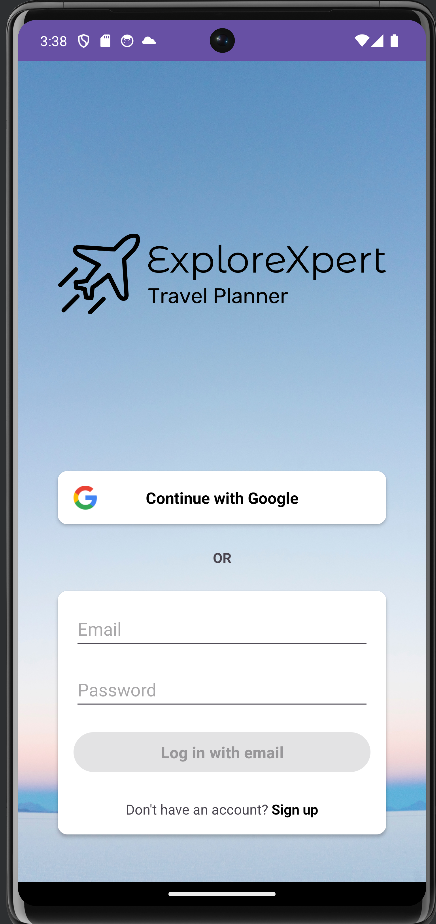
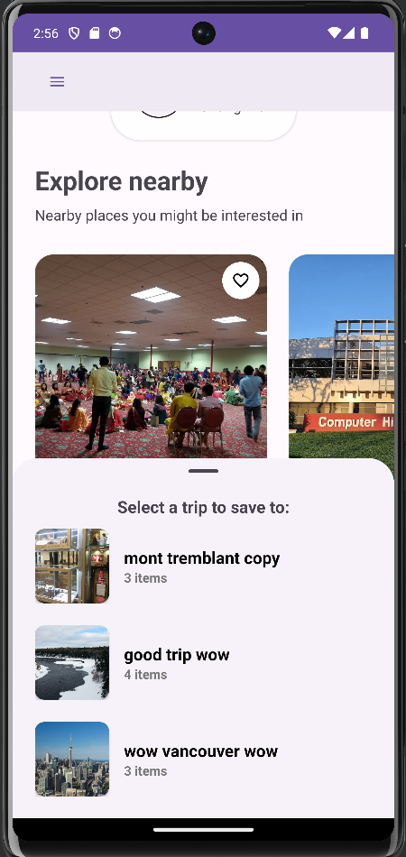
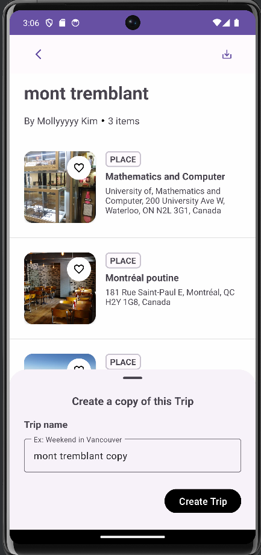
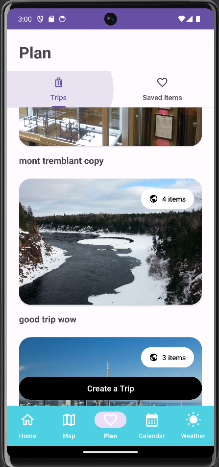
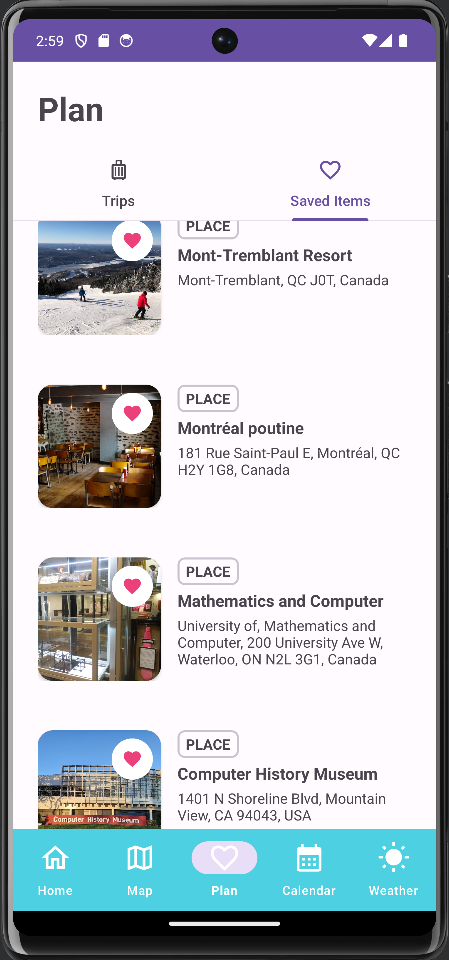
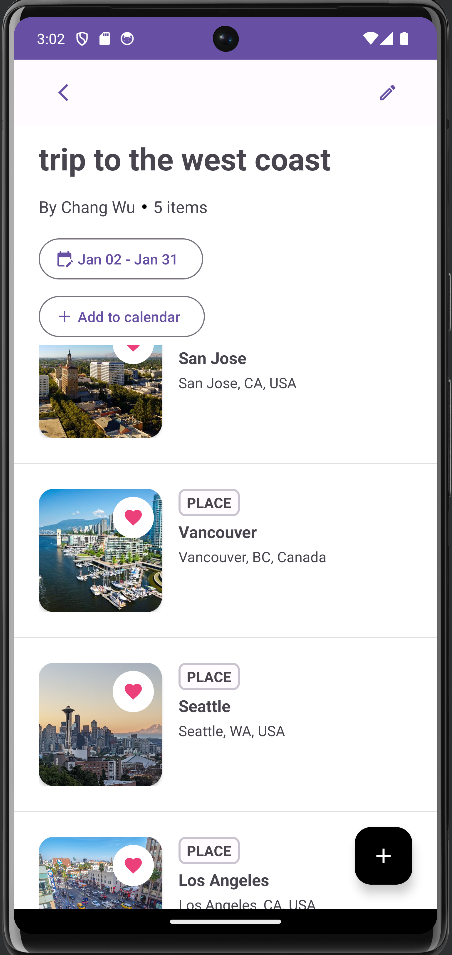
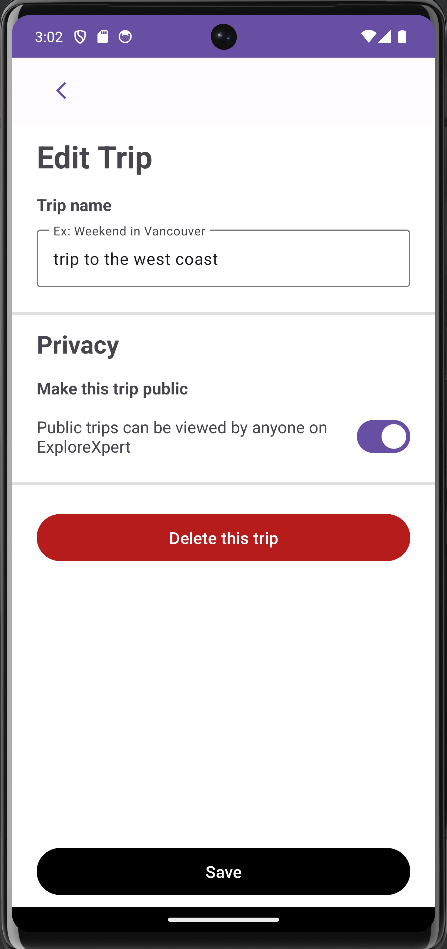

# CS346 Project (ExploreXpert)

## Team Members

* Chang-Syuan Wu (c275wu), Mick Wang (m479wang), Richard Zhang (r468zhan), Yi Bo Cheng (ybcheng)
* @uwaterloo.ca

## Screenshots/Videos

### Login screen

### Home screens

### Plan screens

### Weather screens

Optional, but often helpful to have a screenshot or demo-video for new users.

## Quick-Start Instructions
* [Quick Start Guide (WIP)](https://git.uwaterloo.ca/c275wu/cs346-project/-/wikis/Quick-Start-Guide)

## Project Documents
* [Project Proposal](https://git.uwaterloo.ca/c275wu/cs346-project/-/wikis/Project-Proposal)
* [Goals and Requirements](https://git.uwaterloo.ca/c275wu/cs346-project/-/wikis/Requirements)
* [Meeting Minutes](https://git.uwaterloo.ca/c275wu/cs346-project/-/wikis/Meeting-Minutes)
* [Design & Architecture](https://git.uwaterloo.ca/c275wu/cs346-project/-/wikis/Design-Doc)

## Software Releases
* [Releases](https://git.uwaterloo.ca/c275wu/cs346-project/-/releases)

## License
For open source projects, say how it is licensed.
