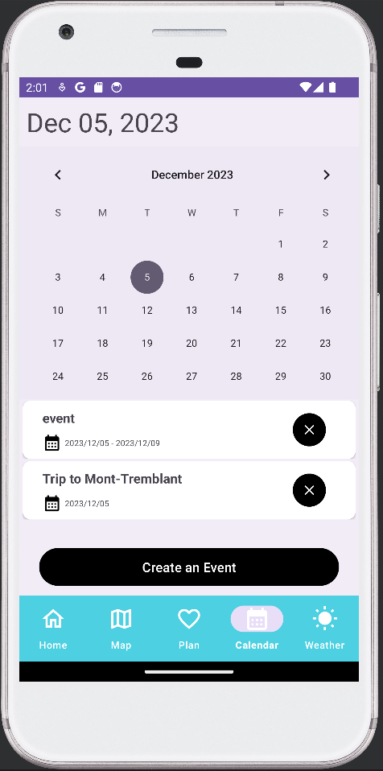
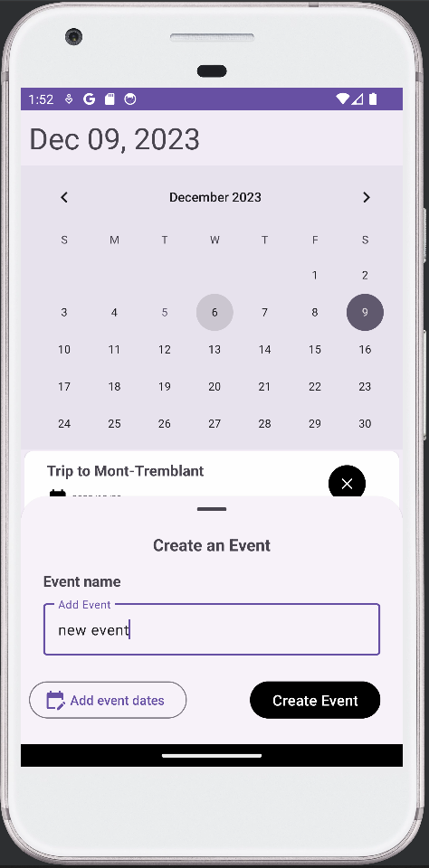

# ExploreXpert
Travel planning Android app created as part of the CS346 course at the University of Waterloo

## Screenshots/Videos

### Login screen

### Home screens

### Plan screens

### Maps screen

### Weather screens

## Calendar screens

