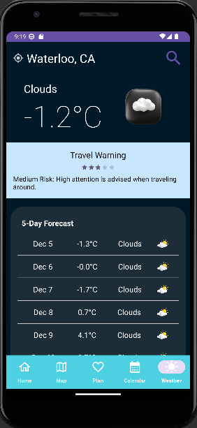

# CS346 Project (ExploreXpert)

## Goal
The goal of our travel planner app is to simplify and enhance the way people plan their trips by providing a comprehensive and user-friendly Android app. We want to offer a seamless experience that enhances the entire journey, from initial trip conceptualization to finalizing schedules.

With the intent of being a one-stop solution, our app offers personalized recommendations, essential travel information, and booking and scheduling features. Our primary focus is on simplifying the travel planning process, ensuring it becomes more accessible and enjoyable for users. 

## Team Members

* Chang-Syuan Wu (c275wu), Mick Wang (m479wang), Richard Zhang (r468zhan), Yi Bo Cheng (ybcheng)
* @uwaterloo.ca

## Screenshots/Videos
### Home screen

### Maps screen

### Weather screens

Optional, but often helpful to have a screenshot or demo-video for new users.

## Quick-Start Instructions
* [Quick Start Guide (WIP)](https://git.uwaterloo.ca/c275wu/cs346-project/-/wikis/Quick-Start-Guide)

## Project Documents
* [Project Proposal](https://git.uwaterloo.ca/c275wu/cs346-project/-/wikis/Project-Proposal)
* [Meeting Minutes](https://git.uwaterloo.ca/c275wu/cs346-project/-/wikis/Meeting-Minutes)
* [Design & Architecture](https://git.uwaterloo.ca/c275wu/cs346-project/-/wikis/Design-Doc)

## Software Releases
* [Releases](https://git.uwaterloo.ca/c275wu/cs346-project/-/releases)

## License
For open source projects, say how it is licensed.
